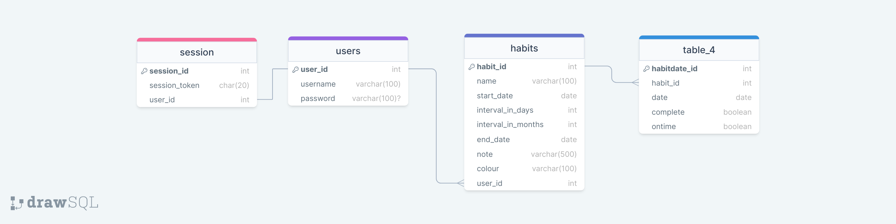
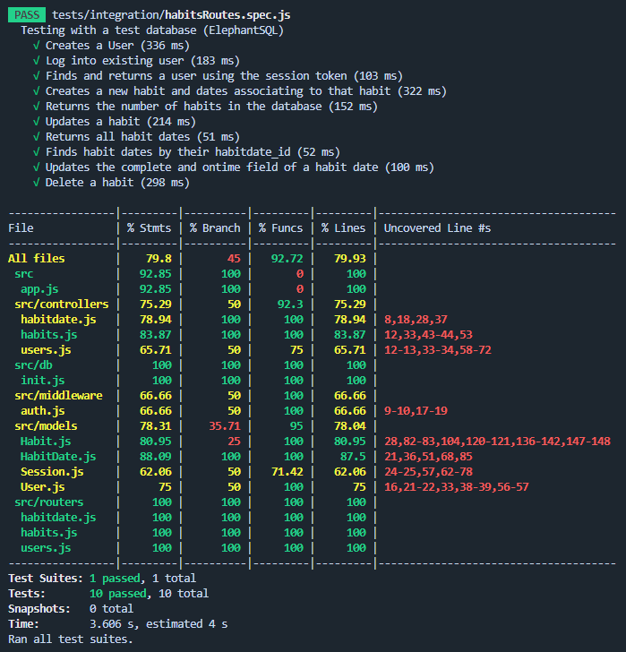

# Habitual Server Side
The project task given to us was to create a habit tracking web app where users can create an account, login and track their habits

This repository stores the server side code of this project: The Habits API

## Purpose
### Why Habit Tracking is important?
- Assists in beginning habits
- It boosts motivation to see your progress
- Provides a visual cue that can be a reminder to act

Habitual is a web app that helps you in building good habits and reaching your goals
A customisable tracker where you can create and track your own habits, and work towards building a streak to show off. 
Habitual: A platform for you to “become the best you”

## Our Process
- Day 0 (Design): Brainstorming and planning the steps of the project to achieve our desired goal
- Day 1: The initial building of both the client and server side
- Day 2: Connecting the client and server side together
- Day 3: Debugging and implementing desired functionality onto the site (i.e. editing and deleting habits)
- Day 4: Finishing touches to the website

## Functionality
For the design of Habituals, we took the user specifications and seperated them into system requirements.

### Requirements
- Users are able to login:
    - Users can create an account if they do not have one already
    - Users cannot access the website without an account logged in
    - Users passwords are not stored in plaintext in the database
- Users are be able to choose a habit they want to track and choose the frequency which the habit appears
    - Create a new habit, users can input:
        - name (required)
        - start date & end date (required)
        - interval in days/months (required)
        - note
        - colour
    - This habit will then appear on the users dashboard in either Overdue Habits, Todays Habits or Upcoming Habits
    - Users can also edit the name, note and color of their habit in the "All" tab
- Users are able to mark habits as complete and view a recent completion streak
    - A checkbox will be placed next to habits on the dashboard and users can click on the tick to mark the habit as complete
        - If an overdue habit is marked complete, it will disappear on a page refresh
        - If a today's habit is marked complete, it will be shown to the user so that they can view what has been completed for the day
        - Users cannot complete upcoming habits, only view it
    - A streak counter will be presented on the dashboard to the user

## Installation & Usage

### Installation
- Clone or download this repo
- Navigate to the 'src' folder
- Use the command: 'npm install' or 'npm i', to install relative libraries

### Usage
- npm run start to start API
- npm run test to start tests on API
- npm run setup-dev to reset the database
- The API alone does not present much as you need authentication to access the habits routes

## Technologies
- Express: Implement our Habits API
- Nodemon/Node: Running the API
- Bcrypt: Encrypting user passwords using hashes
- Dayjs: Used to perform arithmetic functions (i.e. add/subtract) on dates
- Postgres: We opted for a SQL database due to our data schema
- ElephantSQL: Used for database storage
- Jest and supertest: Testomg API routes, controllers and models

## More details on the API

The API was created using express and pg (postgres), the data within the SQL database follows the data schema we created (see below)

There are 3 sets of models, controllers and routes for our data: Habits, HabitDates, and Users

The routes and their functionality for each of the models are:
- User:
    - GET /users/register - Registering a new user
    - POST /users/login - Log into an existing user
    - DELETE /users/logout - Logout of 'this' user
    - POST /users/:sessiontoken - Find username by their session token
- Habits: (NOTE: this path is not accessible without authorization first)
    - GET /habits - Showing all habits belonging to a user
    - POST /habits - Create a new habit with 'this' user ID
    - GET /habits/:id - Find a habit via habit_id
    - PUT /habits/:id - Updating the fields of a habit, i.e marking one as complete
    - DELETE /habits/:id - Deleting a habit
- HabitDates:
    - GET /habitdates - Showing all habit dates in the database
    - GET /habitdates/:id - showing a single habit date via the habitdate_id
    - GET /habitdates/habits/:id - showing all habit dates associating with a specific habit
    - PUT /habitdates/:id - Updating a habit date

A test suite was also created using jest and a test database on ElephantSQL to test these routes achieving ~80% test coverage

## Wins & Challenges
### Wins
- The API follows the data schema as intended
- All routes in the API work as intended
- CRUD functionality can be performed successfully on the API
- Date manipulation works correctly with the help of dayjs library
- Usernames have to be unique
- User passwords are successfully encrypted and stored in the database
### Challenges
- Designing the data schema and figuring out the way to implement streaks using the habit dates
- Switching between using test database during tests and the main database when running normally
- Implementing where a HabitDate is created for each day between a habit's start and end date
## Future Features
- Adding a category element to the Habits object so that the client side is able to categorize habits

## Licence

[MIT licence](https://opensource.org/licenses/mit-license.php)
